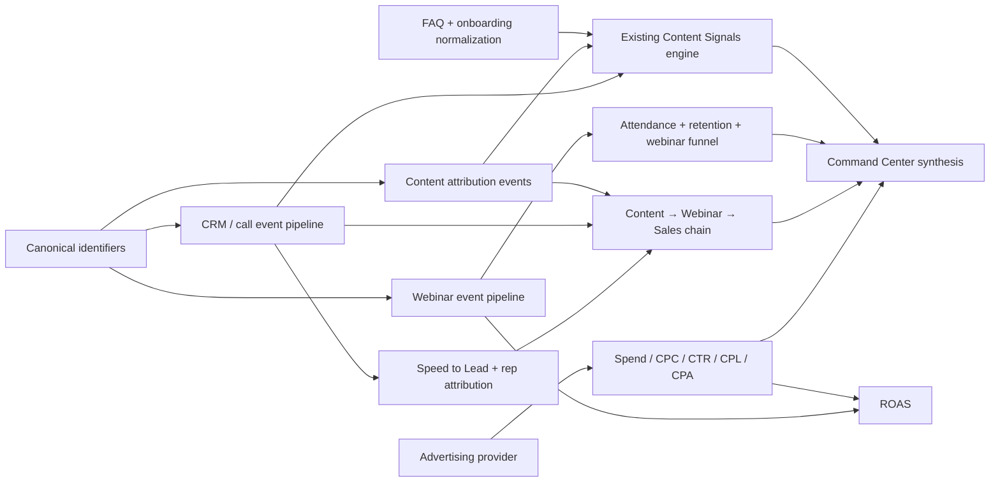

# InsightOS Dependency-Driven Implementation Roadmap

**Prepared from:** the completed technical gap audit and the current InsightOS working tree.
**Scope:** planning only. No application code, migration, provider connection, production data, or `main` branch was modified for this roadmap.

> **Operating rule:** Do not add another visual foundation or speculative data layer. The remaining work must proceed from source contract → event capture → server function → aggregation → filter → UI → browser verification.

## Dependency graph

The graph has one important ordering constraint: **canonical identifiers must be defined before event capture**, and event capture must precede reliable aggregation. The UI already exists for many of these surfaces; changing the UI before the source contracts are authoritative would create another partial foundation.

## A. Currently Complete

These capabilities are genuinely usable in the current branch for the data they receive:

| Capability | Current implementation | Completion boundary |
|---|---|---|
| Main VSL | Existing VSL route, forms, metrics, transcript, and analysis flow | Complete for current VSL records |
| Testimonial Videos | Added as a first-class kind inside the existing VSL system | Complete as a VSL workflow; visual family verification remains a separate UI task |
| Existing FAQ Videos | Existing FAQ video records and click/play/watch metrics feed Content Signals | Complete for fields that exist on the records |
| Content Signals core engine | Existing `computeDemand` / `content-signals.server.ts` consumes content performance, FAQ video metrics, VSL snapshots, setting-call signals, onboarding mechanism tags, and coverage baselines | Complete as the existing engine; normalized FAQ/onboarding demand objects remain incomplete |
| Content Command Center visual architecture | Levels, KPI strip, custom curved Sankey, intelligence stack, tooltips, Content Signals, and operational pipeline are present | Complete as a visual architecture, not as a universal cross-system attribution ledger |
| Content performance calculations | Existing content-performance utilities and baseline-relative mechanism/platform analysis | Complete for populated content metric rows |
| TOF/MOF/BOF assignment | Persisted funnel-stage field and content form support exist | Complete for newly assigned records; historical nulls remain null |
| DM Setter platform filtering | ActivityModule filters rows before downstream calculations | Complete for available activity source values |
| Inbound Dialer platform filtering | Existing activity/event filtering | Complete for available activity and response-event source values |
| Closer platform filtering | Canonical nullable call attribution fields and Closer filtering | Complete for populated canonical call fields |
| Speed-to-Lead calculation | Assignment-first, creation fallback, first attempt/connection, median/average/distribution utilities | Complete for rows with required timestamps |
| Webinar aggregation | Six-stage aggregation, paid/organic separation where fields exist, financial fields, safe ROAS behavior | Complete as an aggregation layer for populated metric rows |
| Webinar retention calculation/UI | `webinar_events` query, retention curve, chart, and honest unavailable state | Complete for event-backed records |
| Webinar comparison utility/UI | Independent Webinar B query, aggregation, comparison table | Complete for populated independent datasets |
| Safe unavailable states | Existing webinar and Speed-to-Lead UI avoids fabricating metrics | Complete as a safety behavior |

## B. Can Finish Now With Existing Internal Data

These are the next low-risk tasks that do not require choosing an external provider, assuming the relevant existing rows are actually present:

| Work item | Existing source | Exact implementation | Unlocks |
|---|---|---|---|
| Finish Post-booking VSL visual consistency | Existing Post-booking route, shared video/VSL components | Move Post-booking into the existing VSL shell, spacing, tabs, card tokens, loading, and empty states | Consistent Main/Webinar/Post-booking/Testimonial/FAQ family |
| Add complete browser interaction verification | Existing routes and controls | Use authenticated browser inspection to open each route, select tabs, change date range, select platform/day/time filters, choose Webinar A/B, and record visible results/errors | Reliable acceptance evidence |
| Complete Speed-to-Lead rep selector wiring | `lead_response_events.rep_id`, existing team-member selector | Resolve the canonical rep ID/name mapping and apply the selected rep before `speedDistribution` and `compareSpeedBuckets` | Rep segmentation |
| Complete Speed-to-Lead campaign/source controls | `lead_response_events.source_platform`, `lead_source`, `campaign` | Add lead-source and campaign selectors using distinct option lists from the event query; keep null/unknown explicit | Campaign and lead-source segmentation |
| Add source-labelled FAQ demand objects | Existing FAQ/FAQ video rows | Normalize only explicit question/title/objection/topic fields into the current Content Signals input contract with `source: FAQ` | Recurring/rising/unanswered FAQ signals |
| Add source-labelled onboarding demand objects | Existing intake/client onboarding rows and mechanism scoring | Normalize only explicit answer fields into the current Content Signals input contract with `source: Client Onboarding` | Pain-point, objection, roadblock, and training signals |
| Add taxonomy aggregation selectors | Existing content fields and content performance query | Add reusable dimension filters/aggregations for funnel stage, pillar, variation, platform, and format | Content Intelligence, Signals, Command Center, reporting |
| Add existing-data webinar financial joins | Existing payment/client/order fields where they carry a shared lead/client ID | Reuse current ledger queries; only join when stable IDs match | Attributable deposits, revenue, refunds, bumps, upsells |

## C. Requires Internal Event Tracking

InsightOS can generate these records itself, but they are not reliably captured today. These should be defined as versioned event contracts before UI expansion.

### CRM / call / rep event contract

| Event | Required fields | Required timestamp | Destination |
|---|---|---|---|
| Lead created | `lead_id`, `org_id`, source/platform/campaign, content/webinar IDs when known | `lead_created_at` | `leads`, event log |
| Lead assigned | `lead_id`, `rep_id` | `lead_assigned_at` | `lead_response_events` |
| First attempt | `lead_id`, `rep_id`, channel, attempt ID | `first_attempt_at` | `lead_response_events` |
| First connection | `lead_id`, `rep_id`, channel, connected outcome | `first_connection_at` | `lead_response_events` |
| Qualified conversation | `lead_id`, conversation/call ID, rep ID, qualification outcome | `qualified_at` | `lead_response_events`, calls |
| Set | `lead_id`, setter/rep ID, set outcome | `set_at` | `lead_response_events`, calls |
| Booked call | `lead_id`, calendar/call ID | `booked_at` | `calls`, webinar attribution |
| Show | `call_id`, lead ID, show outcome | `showed_at` | `calls` |
| Offer | `call_id`, offer/product ID | `offer_at` | `calls` / order attribution |
| Close | `call_id`, order/client ID, rep ID | `closed_at` | `calls`, orders/payments |
| Cash | order/payment ID, amount, currency, product line | `paid_at` | existing financial ledger plus nullable attribution IDs |

The existing `lead_response_events` table already has creation/assignment/first-attempt/first-connection, rep, source platform, lead source, campaign, and downstream boolean fields. It still needs actual ingestion from the CRM/call path and timestamp fidelity for the downstream stages.

### Content and webinar attribution events

| Event | Required fields | Enables |
|---|---|---|
| Content impression/interaction snapshot | content ID, platform, format, mechanism, variation, funnel stage, date, views/reach/interactions | Content analytics and platform reporting |
| Content attribution touch | content ID, session/lead ID, UTM/source/campaign, timestamp | Content → lead linkage |
| Webinar registration | webinar ID, lead/contact ID, content ID/source, campaign, timestamp | Content → webinar registration |
| Webinar engagement milestone | webinar ID, lead/contact ID, milestone, timestamp | Attendance/retention/pitch |
| Webinar application | webinar ID, lead ID, application ID, timestamp | Application stage |
| Webinar-to-call linkage | webinar ID, lead ID, call ID | Booked/show/close chain |
| Webinar-to-order linkage | webinar ID, lead/client ID, order/payment ID | Cash and ROAS attribution |

### FAQ/onboarding signal events

| Event | Required fields | Enables |
|---|---|---|
| FAQ demand observation | FAQ ID, normalized text, category/objection, source date, interaction count, answered flag | Recurring, rising, unanswered FAQ signals |
| Onboarding demand observation | intake/client ID, normalized theme, raw answer field, source date, explicit pillar evidence | Recurring onboarding pain points, objections, requested training |
| Setting-call demand observation | call ID, normalized objection/question/topic, rep, date, outcome | Source-labelled setting-call signals |

## D. Requires External Provider

No provider should be connected automatically. The following contracts are required only if the corresponding source does not already exist in an approved internal system.

| Provider category | Exact data required | InsightOS destination | Metrics unlocked |
|---|---|---|---|
| Meta Ads / Google Ads / TikTok Ads | account, campaign/ad-set/ad IDs, date, spend, impressions, clicks, landing-page visits, conversion IDs, remarketing flag | Governed acquisition/spend tables linked to `campaign`, `webinar_id`, and content/source IDs | Spend, CPC, CTR, paid visits, paid leads, CPL, CPA, remarketing spend, ROAS |
| Instagram / YouTube / TikTok analytics | post/video ID, platform, format, impressions/reach/views/watch time/retention/interactions, date | Content metric snapshots keyed to canonical content ID | Platform performance, retention, reach, format comparisons |
| Webinar provider | webinar/session ID, registration, attendance milestones, pitch/exit timestamps, participant ID, source/content IDs | `webinars`, `webinar_events`, `webinar_metrics` | Registration, attendance, retention, pitch, webinar attribution |
| Email provider | campaign/message ID, webinar ID, recipient/lead ID, delivery/open/click timestamps | Notification/email event table | Confirmation open rate, CTOR, group conversion |
| SMS provider such as Twilio | message ID, lead ID, webinar ID, delivery/reply/click status, timestamps | Notification event table | SMS delivery, interaction, call notification metrics |
| CRM/call provider | lead lifecycle events, rep IDs, attempt/connection/qualification/set/book/show/close timestamps, stable IDs | `lead_response_events`, `calls`, attribution fields | Full Speed-to-Lead conversion comparison and rep/call chain |
| Payment processor | order/payment ID, customer/lead ID, product line, gross/net amount, refund status, bump/upsell type, attribution IDs | Existing payment/order ledger with nullable attribution fields | Financial linkage, refunds, order bumps, upsells, attributable revenue |
| Typeform/onboarding provider | response ID, question key, answer, client ID, timestamp | Existing onboarding/intake source plus normalized signal input | Structured onboarding demand signals |
| Calendar/booking provider | booking ID, lead ID, call ID, booked/show/cancel timestamps | Existing calls/calendar records | Booked-call and show rates |

## E. Historical Limitations

The following cannot be reconstructed legitimately for old records that lack the required identifiers or timestamps:

1. Content cannot be assigned to a webinar, lead, call, close, or cash payment without a stable content/source/UTM or attribution event.
2. Platform, format, mechanism, variation, and funnel stage cannot be backfilled for untagged historical content without source evidence.
3. Speed to Lead cannot be calculated without creation/assignment and first-attempt timestamps.
4. Downstream Speed-to-Lead conversion comparisons cannot be calculated without response timing and the corresponding outcome events for the same lead.
5. Webinar retention cannot be reconstructed from aggregate attendance totals; it requires milestone timestamps from `webinar_events`.
6. ROAS cannot be reconstructed without attributable spend and attributable revenue for the same chain.
7. Email open rate/CTOR and SMS notification metrics cannot be inferred from lead totals or send counts.
8. Refund, order-bump, upsell, and CPA metrics cannot be inferred from aggregate cash or total sales.
9. FAQ “rising,” “unanswered,” and repeated-objection classifications cannot be reconstructed without dated source text and interaction/answer state.
10. Onboarding demand themes cannot be reconstructed where only an aggregate mechanism tag exists and the underlying response text is absent.

## F. Implementation Order

### Step 0 — Freeze the current safe baseline

Record the current upgrade branch commit and preview source directory. Confirm that no production Supabase connection is used by development. Do not merge or reset any branch.

### Step 1 — Define canonical identifiers

Approve the identifier contract for content, platform, format, funnel stage, mechanism, variation, webinar, lead, rep, call, order/payment, campaign, FAQ item, and onboarding response. Every downstream event depends on these keys.

### Step 2 — Complete the internal CRM/call event pipeline

Implement ingestion and timestamp capture for lead creation, assignment, attempt, connection, qualification, set, booking, show, offer, close, and payment. Populate `lead_response_events` and preserve nullable attribution for legacy rows.

**Unlocks:** Speed to Lead, rep attribution, platform attribution, Closer outcomes, downstream conversion analysis, future C4 Sentinel queries.

### Step 3 — Finish the Speed-to-Lead UI over real events

Wire rep, source platform, lead source, campaign, date, weekday, and time-of-day filters to the event query. Ensure all summary and comparison values recompute from the filtered event set. Keep the comparison explicitly observational.

### Step 4 — Complete webinar internal event capture

Capture registration, attendance milestones, engagement, pitch, application, booked call, show, close, and cash linkage using stable webinar/lead/call/order IDs.

**Unlocks:** Event-backed retention, complete six-stage funnel, content-to-webinar attribution, webinar-to-cash attribution.

### Step 5 — Normalize FAQ, onboarding, call, coverage, and platform inputs

Add source adapters into the existing Content Signals engine. Do not introduce a second recommendation engine. Preserve source labels and map to the four pillars only when semantic evidence exists.

### Step 6 — Finish content taxonomy analytics

Expose reusable filters and aggregation functions across funnel stage, four pillars, variation, platform, and format. Use existing metric formulas for views, reach, interactions, leads, clients, closes, cash, and retention.

### Step 7 — Connect content-to-webinar-to-sales attribution

Add only nullable attribution IDs required for future records. Aggregate paths in the Content Command Center when the complete relationship exists. Render partial/unavailable states when one or more links are absent.

### Step 8 — Audit existing financial and acquisition sources

Before choosing a provider, inspect any approved internal connector or tracking source for spend, clicks, impressions, campaign, payments, refunds, bumps, and upsells. Reuse existing ledgers; do not create duplicates.

### Step 9 — Select and connect external providers

Only after the internal contract is approved, select the minimum providers: one ad provider, one webinar provider, one email/SMS source, and one payment/CRM source as needed. Implement idempotent ingestion keyed by provider IDs.

### Step 10 — Complete UI-only consistency and browser acceptance

Finish the Post-booking VSL visual family alignment. Browser-test every required route and interaction using real or explicit no-data states. Do not equate HTTP 200 with completion.

## G. Estimated Completion After Each Step

| Milestone | Estimated functional completion | Rationale |
|---|---:|---|
| Current safe branch | 68% | Core surfaces, visual systems, initial aggregations, filters, retention, comparison, VSL kinds, and event foundations exist |
| Canonical identifiers approved | 70% | Removes ambiguity but does not yet create historical data |
| CRM/call/rep event pipeline | 79% | Unlocks the largest remaining block: Speed to Lead outcomes, rep attribution, call chain |
| Speed-to-Lead UI fully event-backed | 82% | Segmentation and observed conversion comparison become genuinely data-driven |
| Webinar event pipeline | 87% | Completes attendance/retention/funnel linkage for future webinars |
| FAQ/onboarding normalization | 90% | Makes Content Signals source-complete for available internal demand data |
| Content taxonomy and attribution joins | 93% | Makes Command Center and reporting cross-dimensional where IDs exist |
| Acquisition provider | 96% | Unlocks spend, CPC, CTR, CPL, CPA, and legitimate ROAS |
| Email/SMS/notification sources | 98% | Unlocks confirmation and notification metrics |
| Post-booking UI consistency and browser acceptance | ~100% of currently supported functionality | Reaches acceptance only after every connected source path is tested; historical limitations remain explicitly documented |

These percentages are functional estimates, not file-count estimates. They assume the required providers and internal event contracts are implemented correctly. They do not treat empty placeholder states as data-backed completion.

## Immediate next decision

The next implementation should begin with **Priority 1: CRM / Call / Rep Event Pipeline**. It has the highest dependency fan-out and is entirely within the product’s control. Before coding it, approve the event-field contract and identify the authoritative CRM/call source. Do not begin an advertising, email, or webinar-provider integration until that source-of-truth decision is made.

## Safety constraints carried forward

- No fabricated production analytics.
- No synthetic ROAS, attendance, spend, refunds, bumps, upsells, FAQ demand, or onboarding signals.
- No duplicate recommendation engine or financial ledger.
- No destructive migration of historical attribution.
- No production Supabase changes.
- No merge into `main`.
